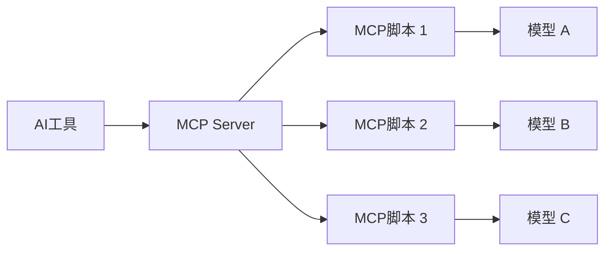

# Model Context Protocol (MCP)

## 简介
MCP(Model Context Protocol)是一种用于规范和优化AI工具与大语言模型交互的协议框架。它允许开发者通过编写MCP脚本来自定义AI工具（如Cursor）与不同模型的交互行为。

## 核心架构

### 1. MCP Server
- 作为AI工具与模型间的中间层
- 管理多个MCP脚本的加载和切换
- 处理上下文和状态管理
- 提供统一的API接口

### 2. MCP 脚本
```typescript
interface MCPScript {
    name: string;           // 脚本名称
    description: string;    // 脚本描述
    model: string;         // 目标模型
    rules: {
        context: ContextRule[];    // 上下文规则
        prompt: PromptRule[];      // 提示词规则
        response: ResponseRule[];   // 响应规则
    };
    handlers: {
        onInit(): void;           // 初始化处理
        onMessage(msg: any): void; // 消息处理
        onError(err: any): void;   // 错误处理
    };
}
```

### 3. 工作流程


## 实现示例

### 1. Cursor中的MCP应用
```python
# cursor/mcp/claude_mcp.py
class ClaudeMCP:
    def __init__(self):
        self.context = []
        self.rules = self.load_rules()
    
    def process_message(self, message):
        # 应用Claude特定的处理规则
        processed = self.apply_rules(message)
        return processed
    
    def load_rules(self):
        return {
            "context_length": 4000,
            "temperature": 0.7,
            "format": "markdown"
        }
```

### 2. 规则定义
```yaml
# cursor/mcp/rules/claude.yaml
name: claude_mcp
model: claude-3
rules:
  context:
    max_length: 4000
    priority_rules:
      - code_blocks: high
      - error_messages: high
      - user_input: medium
  prompt:
    templates:
      - role: assistant
        content: "You are a helpful AI assistant..."
  response:
    format: markdown
    code_style: true
```

## 应用场景

### 1. 开发工具适配
- **Cursor**: 代码编辑和补全
- **VSCode插件**: 编程助手
- **JetBrains插件**: IDE集成

### 2. 多模型支持
- Claude系列模型
- GPT系列模型
- 国内模型适配
- 开源模型接入

## 最佳实践

### 1. 脚本开发
- 模块化设计
- 错误处理完善
- 性能优化
- 可扩展性考虑

### 2. 规则配置
- 场景特化
- 灵活配置
- 版本管理
- 动态更新

### 3. 调试优化
- 日志记录
- 性能监控
- 错误追踪
- 测试覆盖

## 高级特性

### 1. 上下文管理
- 动态窗口调整
- 优先级排序
- 记忆压缩
- 状态同步

### 2. 提示词优化
- 模板系统
- 动态组合
- 场景适配
- A/B测试

### 3. 响应处理
- 格式规范化
- 质量控制
- 错误重试
- 结果优化

## 发展方向
1. 更灵活的脚本系统
2. 更智能的规则引擎
3. 更强大的调试工具
4. 更广泛的工具集成
5. 更完善的生态系统

## 参考资源
- [Cursor MCP文档](https://cursor.sh/docs/mcp)
- [VSCode AI插件开发指南](https://code.visualstudio.com/api/extension-guides/artificial-intelligence)
- [Claude API文档](https://docs.anthropic.com/claude/docs) 