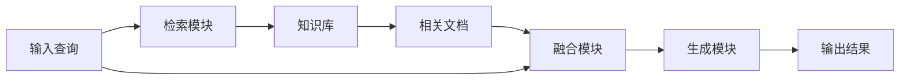

# Retrieval-Augmented Generation (RAG)

## 简介
RAG是一种将检索系统与生成模型相结合的技术，通过检索外部知识来增强语言模型的生成能力。

## 工作原理

### 1. 核心组件
- 检索器（Retriever）
- 生成器（Generator）
- 知识库（Knowledge Base）
- 融合模块（Fusion Module）

### 2. 处理流程


## 技术实现

### 1. 检索系统
```python
class Retriever:
    def __init__(self, knowledge_base):
        self.kb = knowledge_base
        self.index = self._build_index()
    
    def retrieve(self, query, k=5):
        # 检索相关文档
        pass
    
    def _build_index(self):
        # 构建检索索引
        pass
```

### 2. 知识库构建
- 文档预处理
- 向量化存储
- 索引优化
- 更新机制

### 3. 融合策略
- 注意力机制
- 重要性加权
- 一致性检查
- 冲突解决

## 应用场景

### 1. 问答系统
- 知识问答
- 技术支持
- 教育辅导
- 医疗咨询

### 2. 内容生成
- 文档摘要
- 报告生成
- 内容创作
- 代码补全

## 优化技术

### 1. 检索优化
- 向量索引
- 语义匹配
- 多级缓存
- 并行检索

### 2. 生成优化
- 上下文管理
- 一致性控制
- 质量评估
- 错误修正

## 最佳实践

### 1. 系统设计
- 模块化架构
- 可扩展设计
- 错误处理
- 监控机制

### 2. 性能调优
- 索引优化
- 缓存策略
- 批处理
- 资源管理

## 发展趋势
1. 多模态RAG
2. 实时更新
3. 个性化适应
4. 分布式架构 